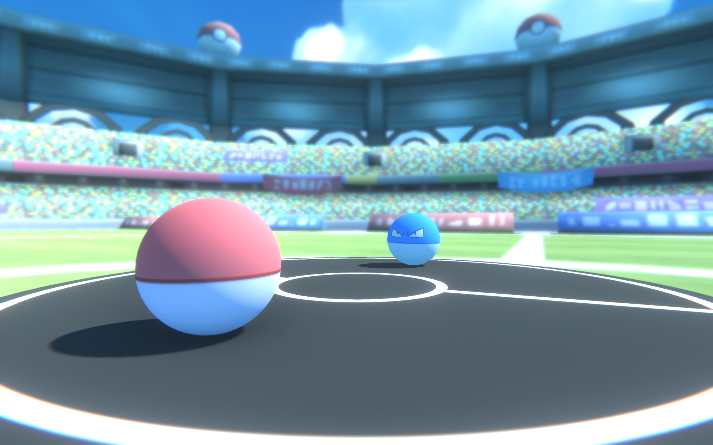
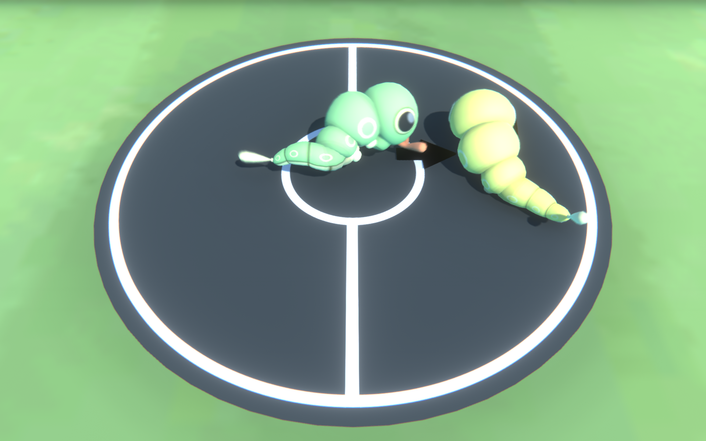
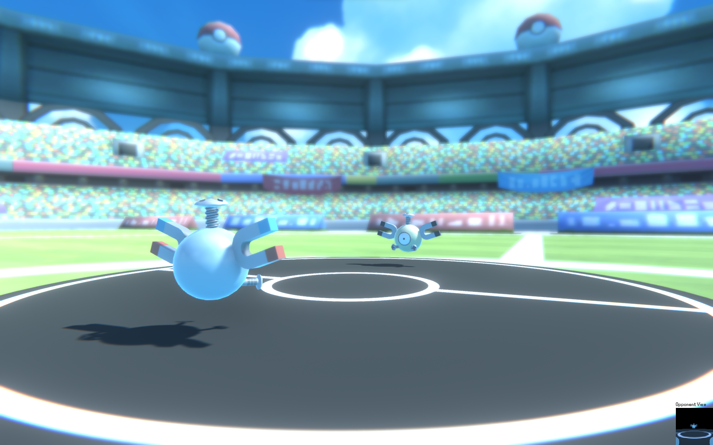

# PokAImon Training: Competitive Multi-Agent RL with GAIL
We train Pokemon agents to sumo fight in a Unity environment with Reinforcement Learning and Generative Adversarial Imitation Learning. More implementation details can be found in our report paper [here](https://github.com/ritabt/PokAImon/blob/main/Report%20Paper.pdf). More details on components of this repo can be found in the original cloned README [here](https://github.com/ritabt/PokAImon/blob/main/UNITY_README.md).

This is our final project for Stanford's CS230 and CS231n. The contributors to this repo are Cole Sohn and Rita Tlemcani.

## Background

We cloned and modified the "Unity ML Agents Toolkit" from [here](https://github.com/Unity-Technologies/ml-agents). They provide some examples for getting started and very detailed instructions in [here](https://unity.com/products/machine-learning-agents). We recommend you check out their starter examples if this is your first time using Unity!

Many of the strategies we used to train our Pokemon agents are from [this paper](https://arxiv.org/pdf/1710.03748.pdf) by OpenAI and the GAIL paper available [here](https://arxiv.org/pdf/1606.03476.pdf). If you're interested in the theory implemented, please check out our report paper [here](https://github.com/ritabt/PokAImon/blob/main/Report%20Paper.pdf) or our presentation slides [here](https://github.com/ritabt/PokAImon/blob/main/Report%20Paper.pdf).

<p align="middle">
  
   
  
</p>
<!-- 


 -->
## Dependencies

To run this repo you need a virtual environment for all your packages. Create a virtual environment with Python 3.8 (the Python version is important for this) then install the packages following the instructions in [here](https://github.com/Unity-Technologies/ml-agents/blob/develop/docs/Installation.md). You don't need to follow the advanced part.

## To use this repo

In `config\` you'll find a few `.yaml` files. These files specify the training configurations. The documentation for how to write these files is [here](https://unity-technologies.github.io/ml-agents/Training-Configuration-File/) but we found that the official documentation is not complete and learning from provided examples has been helpful.

Make a config file with your desired training configuration and follow the instructions below:

Step 1: Activate venv
```sh
envs\ml_agents\Scripts\activate
```

Step 2: Train
```sh
mlagents-learn config\<filename>.yaml --run-id=<new_id_name> --force
```
Note: Config file specifies all the hyperparams, model architecture, optimizer, etc.
Note: Use `--force` if you want to overwrite a model of same run-id from step 0. Use `--resume` instead to resume training

Step 3: Press play in Unity

Step 4: Launch TensorBoard to see training
```sh
tensorboard --logdir results --port 6006
```

Step 5: To test a model, move its `.onnx` file (found in `results/run-id/`) to the unity project Assets directory. In Unity, for both agents, drag model into model reference field. Hit play.

## How to Resume Training
* Set the `--keep-checkpoints` option to a high enough value (before initial training)
* Create a backup of your models folder, then edit the "checkpoint" file and set `model_checkpoint_path` to the cptk file associated with the best results
* Use `--resume` to resume training from this point

Note: You can change reward on second training but you obviously cannot modify model architecture (including number of observations or actions)


## Git Commands
  
Run this command to see what files have been modified since last commit
```sh
git status
```

Run the command below to grab any changes in the repo
```sh
git pull 
```

Run the command below to add specific files/folders
```sh
git add file_name1 file_name2 folder_name
```

or run this command to add the whole directory
```sh
git add . 
```

then commit the files by running the command below. write a small message about what was changed
```sh
git commit -m "my message"
```

then push to see your commits in the repo
```sh
git push 
```

## Important Docs

Trainer File:
https://unity-technologies.github.io/ml-agents/Training-Configuration-File/
  
## Aknowledgments & References
This repo is a cloned and modified version of the [Unity ML Agents repo](https://github.com/Unity-Technologies/ml-agents) and many of the strategies implemented are inspired by [this OpenAI paper](https://arxiv.org/abs/1710.03748). The Pokemon models used are from [this section](https://www.models-resource.com/3ds/pokemonxy/) of the Models Resource website.
